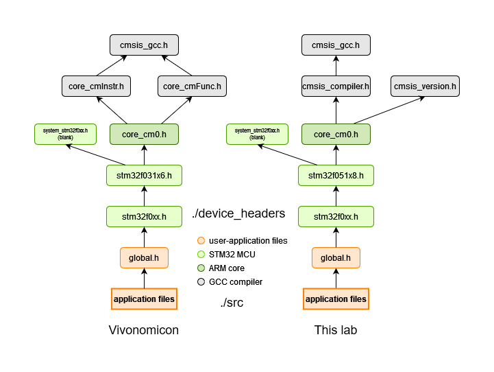
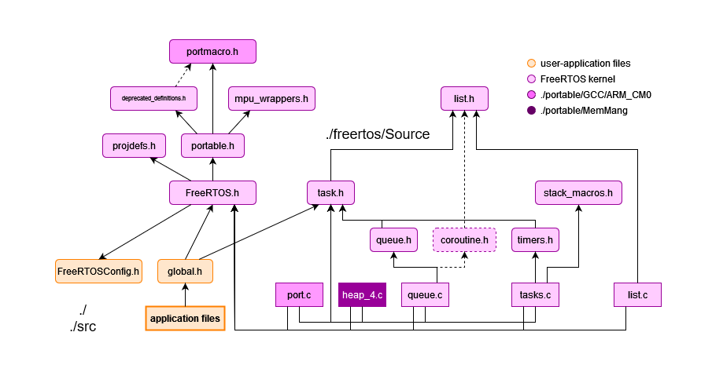

# Guide 1: How to import non-application files
Most projects contain their application files in the `src` folder; 
other folders contain files that can be reused for other projects.
This guide will explain how to populate `boot_s`, `device_headers`, `ld`, 
and `vector_tables` folders. FreeRTOS projects may also include the `freertos` folder, which is included.

# Overview
Each folder is described in the following form:
* Description - What the files are about.
* References - Where the files are directly sourced or inspired from.
* Modify - How to modify the files to tailor other STM32 devices not supported by the project.

This guide will use the STM32DISCOVERY development board as an example.
It uses a STM32F051R8T6 microcontroller unit (MCU), which uses an Arm Cortex-M0 core.

Links to the reference files here (for other devices, search out similar sources):
* [STM32CubeF0](https://github.com/STMicroelectronics/STM32CubeF0 "STM32CubeF0 GitHub") (boot_s, vector_tables, devic_headers)
* [FreeRTOS](https://github.com/FreeRTOS/FreeRTOS "FreeRTOS GitHub") (freertos)

## boot_s and vector_tables

### Description
The file **STM32F051R8T6_boot.S** (boot_s) contains minimal boot code for the STM32 MCU.
It defines the `reset_handler` function, which is called on reset.

The file **STM32F051R8T6_vt.S** (vector_tables) defines a vector table object that lists every
interrupt handler available for the STM32 MCU, with weak aliases included.

### References
Both files are patterned after two portions of the STMicroelectronics file **startup_stm32f051x8.s**, found here:
* `STM32CubeF0/Drivers/CMSIS/Device/ST/STM32F0xx/Source/Templates/gcc/`

### Modify
Import the files from Vivonomicon's GitHub repository to your new project.

To adapt the **boot.S** file for other devices:
* Modify the line containing `.cpu cortex-m0` to the Cortex-M core used by the device.

To adapt the **vt.S** file for other devices:
* Modify the line containing `.cpu cortex-m0` to the Cortex-M core used by the device.
* Modify the vector table object and weak aliases to include interrupt handlers, according to the reference file.

Note that Vivonomicon and STMicroelectronics use different naming conventions for the interrupt handlers (ex. TIM2_IRQ_handler vs TIM2_IRQHandler).
Whatever naming convention is used, use the same names when declaring/defining these ISRs in application files.

## device_headers

*Note: Contrast between GCC compiler files used by Vivonomicon and this repository's projects*

### Description

Every project's top-level application header **global.h** includes **stm32f0xx.h**,
which links to CMSIS files required to compile the project in GCC.
During compilation, the CMSIS files are used for the following:
* GCC compiler - **cmsis_compiler.h**, **cmsis_gcc.h**, **cmsis_version.h**
* ARM core - **core_cm0.h**
* STM32 MCU - **stm32f051x8.h**, **stm32f0xx.h**, **system_stm32f0xx.h**1

1. Vivinomicon does not use the content found in this reference file,
and instead uses an empty dummy file.

### References
Files that pertain to `device_headers` are directly imported from:
* GCC compiler, ARM core - `STM32CubeF0/Drivers/CMSIS/Core/Include/`
* STM32 MCU - `STM32CubeF0/Drivers/CMSIS/Device/ST/STM32F0xx/Include/`

### Modify
The files may be directly imported from STMicroelectronics, with no modifying needed, except for **system_stm32f0xx.h** which is a blank dummy file.

## ld

### Description
The file **STM32F051R8T6.ld** contains the minimum content needed to link memory types,
such as Flash and SRAM, to various GNU memory portions. Other devices (such as STM32F303K6) may have other memory types, like Core Coupled Memory (CCMRAM).

### References
I directly imported the linker file from Vivonomicon; find guides online for LD, the GNU linker.
Look at the device datasheet for your STM32 MCU to check if any advertised RAM is actually CCM RAM.

### Modify
Import the files from Vivonomicon's GitHub repository to your new project.

To adapt the **.ld** file for other devices:
* Modify the value `_estack` to 0x20000000, plus the amount of SRAM (not including CCMRAM)
* In MEMORY, modify the `LENGTH` value for each type of memory.

## freertos (FreeRTOS projects only)

*Note: Dashed links represent includes that are either deprecated or otherwise dependent on other factors.*

### Description
FreeRTOS is a market-leading real-time operating system (RTOS) for microcontrollers and small microprocessors.
The kernel is distributed freely under the MIT open source license.

Every FreeRTOS project's top-level application header **global.h** includes **FreeRTOS.h**, **tasks.h**,
and other headers required to access kernel resources, such as tasks, mutexes, queues, demos, etc.

Files under **freertos** are organized in the following fashion:
* **Demo/** - Demo application files (see the [follow-up](./parts/part6-followup) to Part 6 for an example) 
  * ./include/ - header files
  * ./ - source files
* **Source/** - Kernel files used by every FreeRTOS project and demo application.
  * ./include - header files
  * ./portable - device/compiler specific files
  * ./ - source files

During compilation, the **Source/** files are used for the following:
* Interface between applcation and kernel - **FreeRTOS.h** (required)
* Tasks1 - **tasks.h** (required)

1. Some projects use FreeRTOS resources found in other headers, like **queue.h**, **timers.h**, **semphr.h**; include in **global.h** if needed.

During compilation, the **Demo/** files are used for the following:
* Common demo includes1 - **blocktim.h**, **countsem.h**, **recmutex.h**, **dynamic.h**, etc.

1. FreeRTOS provides demo applications, found [here](https://www.freertos.org/a00102.html).
Remember to add the corresponding source file to the **Demo** subfolder.

Finally, the `FreeRTOSConfig.h` file is used to tailor FreeRTOS settings to the application.

### References
Files that pertain to `freertos` are directly imported from:
* Source - `FreeRTOS/FreeRTOS/Source` -> `FreeRTOS-Kernel`
  * In **Source/portable/**: `./Common`, `./GCC/ARM_CM0`, `./MemMang`
* Demo - `FreeRTOS/FreeRTOS/Demo/Common`

### Modify
The files may be directly imported from FreeRTOS, with no modifying needed.
You may use any project's `FreeRTOSConfig.h` as a template.

