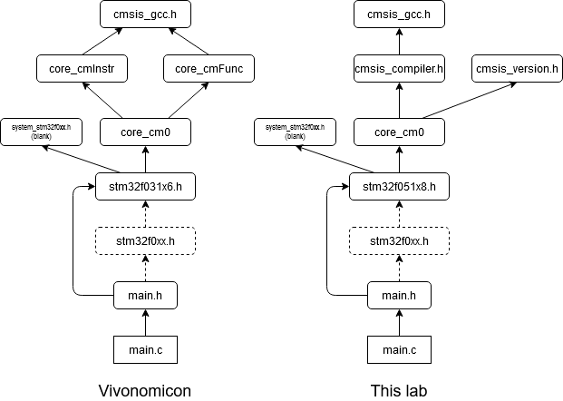

# Part 3: LEDs and Buttons!
This repository is a submit box for Part 3 of Vivonomicon's **"Bare Metal" STM32 Programming** blog series:

https://vivonomicon.com/2018/04/22/bare-metal-stm32-programming-part-3-leds-and-buttons/

For future reference, differences between my code and Vivonomicon's will be highlighted in the Procedure section.

## Hardware
The blog uses a Nucleo development board for the STM32F031K6 chip. For this lab, I used a Discovery development board for the STM32F051R8 chip. See [part1-2](../part1-2) for comparison table.

Different GPIO pins are used for the button and LED:

Label        | VVC's repo | This repo
-------------|------------|---------------
Button       | PB1         | PB12
Embedded LED | PB3         | PC9

## Software
Device header files for STM32F0 can be found in STMicroelectronics' MCU Firmware Package; copy and download required files from:

https://github.com/STMicroelectronics/STM32CubeF0

To find `cmsis` and `core` files, go to `STM32CubeF0/Drivers/CMSIS/Core/Include/`\
To find `stm32` files, go to `STM32CubeF0/Drivers/CMSIS/Device/ST/STM32F0xx/Include/`

Package release used in this lab: v1.11.3 

*Due to updates in the package since the blog post's date, dependency graphs connecting **device_header** and **src** files differ slightly between the project then and now:*

Note: `stm32f0xx.h` is unused by both projects for now. In `main.h`, you may include this header instead of directly including `stm32f051x8.h`

## Procedure
Complete the project as described in Part 3:
* Download/copy required **device_header** from STMicroelectronics.
* Create new folder structure and move files to it. Update Makefile.
* Compile project.
* Setup hardware configuration with board, resistor, button, etc.
* Flash project to chip with `st-flash write main.bin 0x08000000`.

Test project and compare results.

## Author's notes 
None
