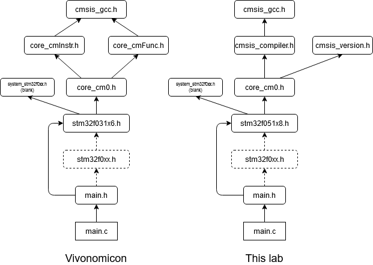

# Part 3: LEDs and Buttons!
This repository is a submit box for Part 3 of Vivonomicon's **"Bare Metal" STM32 Programming** blog series:

https://vivonomicon.com/2018/04/22/bare-metal-stm32-programming-part-3-leds-and-buttons/

For future reference, differences between my code and Vivonomicon's will be highlighted in the Procedure section.

## Hardware
For this lab, I used the STM32F0 Discovery board; other boards are mentioned in the blog:

Development board | STM32F0DISCOVERY | NUCLEO-F031K6
------------------|------------------|---------------
Microcontroller   | STM32F051R8T6    | STM32F031K6
Core              | Cortex-M0        | Cortex-M0
Flash memory      | 64 KB            | 32 KB
SRAM              | 8 KB             | 4 KB
Max frequency     | 48 MHz           | 48 MHz
Package           | LQFP64           | LQFP32

Different GPIO pins are used for the button and LED, due to differences between Nucleo and Discovery boards:

Development board | STM32F0DISCOVERY | NUCLEO-F031K6
------------------|------------------|---------------
Button            | PB12             | PB1
Embedded LED      | PC9              | PB3

## Software
Device header files for STM32F0 can be found in STMicroelectronics' MCU Firmware Package; copy and download required files from:

https://github.com/STMicroelectronics/STM32CubeF0

* To find `cmsis` and `core` files, go to
  * `STM32CubeF0/Drivers/CMSIS/Core/Include/`
* To find `stm32` files, go to
  * `STM32CubeF0/Drivers/CMSIS/Device/ST/STM32F0xx/Include/`
* To tailor your `vector_table` and `core` files for your chip, find its startup file in
  * `STM32CubeF0/Drivers/CMSIS/Device/ST/STM32F0xx/Source/Templates/gcc/`

Package release used in this lab: v1.11.3 

*Due to updates in the package since the blog post's date, dependency graphs connecting **device_header** and **src** files differ slightly between the project then and now:*

Note 1: `stm32f0xx.h` is unused by both projects for now. In `main.h`, you may include this header instead of directly including `stm32f051x8.h`

Note 2: In future projects, refer to [this guide instead](../../docs/import-files.md).

## Procedure
The following activity is featured in this project:
1. Setup breadboard layout to include button.
2. Import device header files
3. Enable and configure General Peripheral Input/Output (GPIO) pins

Compile the project, and flash to chip with `st-flash write main.bin 0x08000000`. Compare results.

## Author's notes 
Straightforward
