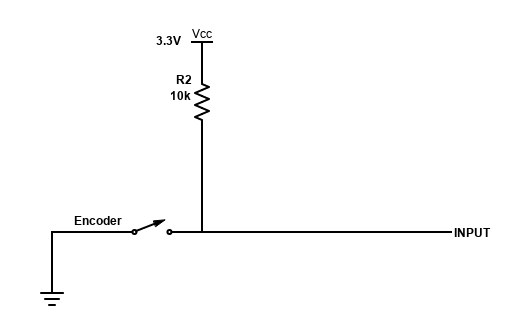
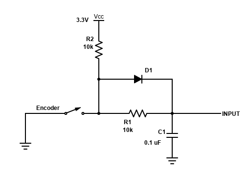

# Part 4 follow-up: Hardware Debounce
This repository is a follow-up mini-project for Part 4 of Vivonomicon's **"Bare Metal" STM32 Programming** blog series:

https://vivonomicon.com/2018/04/28/bare-metal-stm32-programming-part-4-intro-to-hardware-interrupts/

## Hardware
For this lab, I used the STM32F0 Discovery board and Nucleo L031K6 board; any board can be used.

Components used for this project:
* [Rotary encoder](https://www.adafruit.com/product/377?gclid=CjwKCAiAlrSPBhBaEiwAuLSDUHt1ilREWZn4-2v-WEEKNIWFbwG9eb-VHONJ3Z2Gz68ugEbJRtjB9hoCg-cQAvD_BwE) (from Adafruit)
* 10k resistors
* 0.1uF capacitors
* Diodes

## Software
Source code is nearly identical to my submit box for Part 4. The only exception:
* `main.c`: removed lines 23 and 26 setting internal pull-ups. This project uses external pull-ups instead.

## Procedure
### A: No hardware debouncing

1. Construct the circuit for each GPIO input B0 and B1 as shown on the diagram above:
3. Compile and run the code.
4. Rotate the encoder in either direction. Look for brief flashes of light when rotating in the OFF direction.
5. *If you have an oscilloscope*: Capture signals from both input pins. Look for bouncing switch (B0 is on when B1 falls)

Aside from minor oscillations during each signal's fall, occasional bouncing will cause the chip to register the opposite direction the encoder is turning.

### B: Resistor-capacitor debouncing

1. Construct the circuit for each GPIO input B0 and B1 as shown on the diagram:
   * Remove the diode for pin B1.
3. Compile and run the code.
4. Rotate the encoder in either direction.
5. *If you have an oscilloscope*: Capture signals from both input pins. Observe rise and fall times for both pins.

If the values for the resistor and capacitor are chosen correctly, the circuit is debounced. Also note that B1's rise time is longer than B0's, which is equivalent to both fall times. Without the diode, current passes through the pull-up and main resistor to charge B1's capacitor; current from a discharging capacitor passes through just the main resistor to ground.

## Author's notes 
For future projects, I plan to use this hardware debouncing setup (with diode) for any switch-based input devices.
